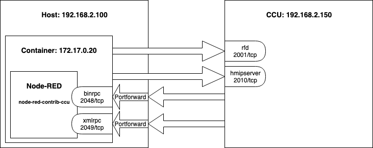
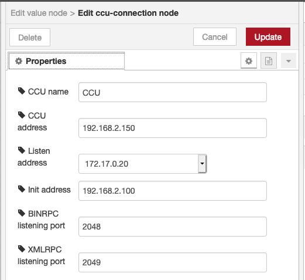
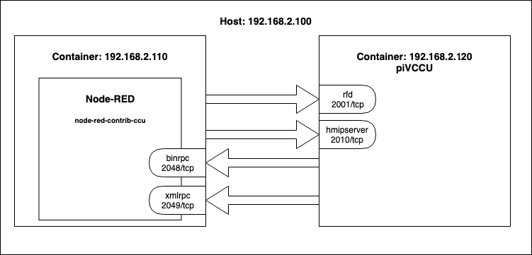
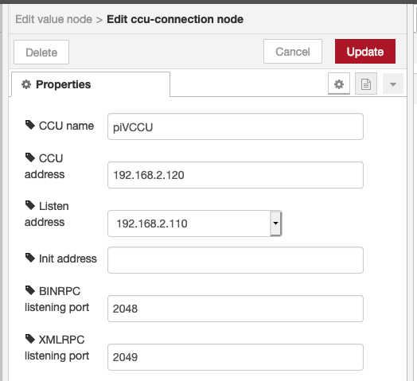
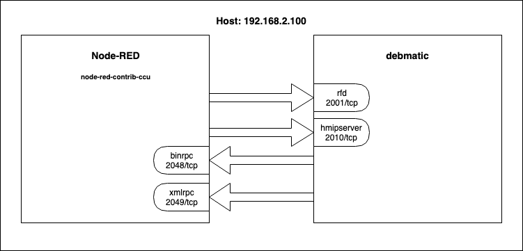
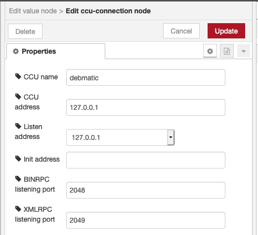

# node-red-contrib-ccu

[![License][mit-badge]][mit-url]

> Node-RED Nodes for the Homematic CCU

With these Nodes you can connect [Homematic](https://github.com/hobbyquaker/awesome-homematic) and 
[Node-RED](https://nodered.org/). Homematic is a series of smart home automation hardware from the manufacturer 
[eQ-3](http://www.eq-3.de/), popular especially in Germany.

For the communication with the CCU both RPC and ReGaHSS remote script are used. It's possible to connect to multiple 
CCUs from one Node-RED instance. RPC setValue calls can be comfortably complemented with ON_TIME and RAMP_TIME values
and special nodes ease the control of displays and mp3 actuators. RPC events can be filtered comprehensively (even 
through regular expressions and also by rooms and functions). It's possible to start rega-programs and set 
rega-variables and last but not least there are nodes to execute arbitrary rega-scripts and RPC calls.

These nodes are included in [RedMatic](https://github.com/rdmtc/RedMatic) which ships Node-RED as an addon package 
for installation on a Homematic CCU3 or RaspberryMatic.

Some example flows can be found in the [RedMatic Wiki](https://github.com/rdmtc/RedMatic/wiki) (German language).

__A modern Browser is required, Internet Explorer won't work.__

## Configuration Examples

The communication with the Homematic CCU needs independent connections in two directions. Node-red-contrib-ccu connects to the CCU's interface listeners (e.g. 2001/TCP for BidCos-RF) while the CCU connects to node-red-contrib-ccu's BINRPC/XMLRPC listeners (2048/tcp and 2049/tcp in examples below).

### NAT'd network

If Node-RED/node-red-contrib-ccu runs inside a Container or a VM with NAT'd network it's necessary to forward/expose the ports for connections _from_ the CCU _to_ node-red-contrib-ccu's callback listeners (example below for a Docker container: use options `-p 2048:2048 -p 2049:2049`in the docker run command). 

The config option `Init address`will be used to tell the CCU on which Address node-red-contrib-ccu is reachable. As 172.17.0.20 is not reachable for the CCU the Hosts IP Address and port forwarding/exposal has to be used. As `Listen address` setting also `0.0.0.0` (which tells node-red-contrib-ccu to bind it's listeners to all available interfaces) would be possible. 

### piVCCU

This example shows a configuration for piVCCU and Node-RED running in containers with bridged networking.

### debmatic

In this example both Node-RED and debmatic are installed on the same (possibly virtual) host.

## License

MIT (c) Sebastian Raff and node-red-contrib-ccu contributors

[mit-badge]: https://img.shields.io/badge/License-MIT-blue.svg?style=flat
[mit-url]: LICENSE
